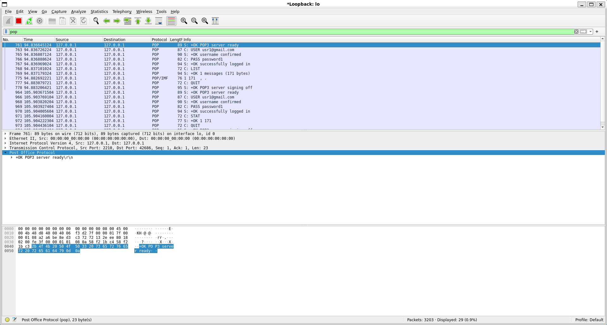
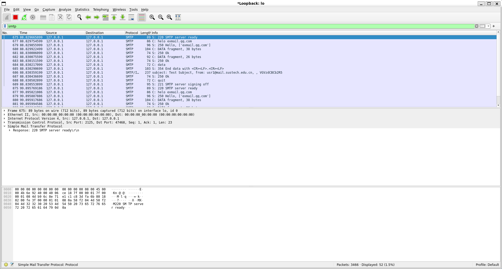
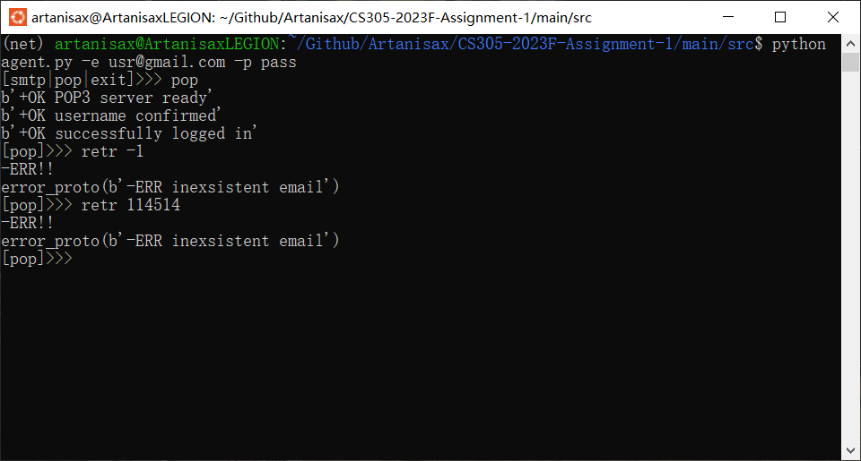
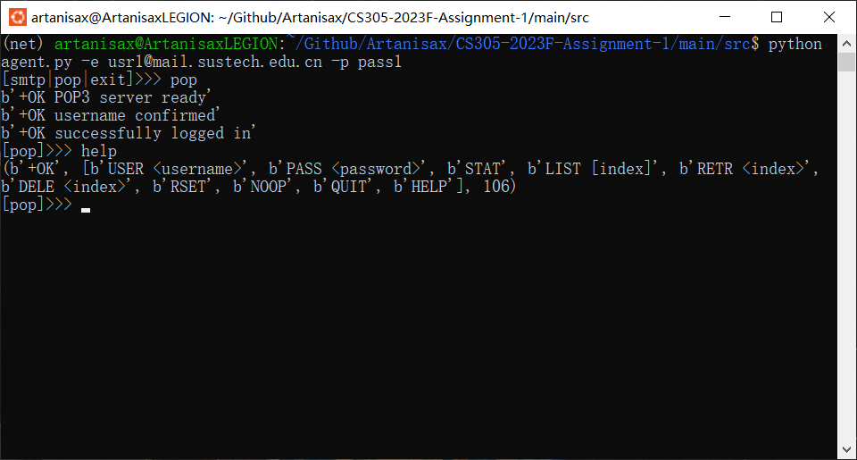

[toc]

# CS305-2023Fall PA1

Name: 陈康睿

SID: 12110524


## Basic Test







## Advance

### Error handling

1. Connection refused
```python
if self.login:
    self.handle_op[cmd](args)
else:
    if not self.username:
        if cmd == 'USER':
            self.handle_op['USER'](args)
        else:
            self.send('-ERR need username for login')
    else:
        if cmd == 'PASS':
            self.handle_op['PASS'](args)
        else:
            self.send('-ERR need password for login')
```
2. Illegal Commands

```python
# all commands and args are checked to some extent
# here are just some examples

def _RETR(self, args):
    if len(args) != 1:
        self.send('-ERR invalid arguments')
        return

    idx = int(args[0]) - 1
    if idx in self.pre_del or idx < 0 or idx >= len(self.mailbox):
        self.send(f'-ERR inexsistent email')
    else:
        size = len(self.mailbox[idx])
        self.send(f'+OK {size} bytes')
        self.request.sendall(self.mailbox[idx].encode())
        print(f'>>> {self.mailbox[idx]}')


def _MAIL(self, args):
    if len(args) != 1:
        self.send(501, 'Invalid arguments')
    if not self.authorization or self.mail_from:
        self.send(503, 'Bad sequence')
    
    username = args[0][6: -1]
    if username not in ACCOUNTS:
        self.send(551, 'User not local')
    else:
        self.mail_from = username
        self.send(250, 'Ok')
```



3. Try-Except Handling

```python
# almost every where in the server source code
conn = socket.socket(socket.AF_INET, socket.SOCK_STREAM)
for server in outsider:
    try:
        host = 'localhost'
        port = int(fdns_query(server, 'P'))
        conn.connect((host, port))
        assert conn.recv(1024).strip().decode().startswith('220')
        
        conn.sendall(f'helo {args.name}\r\n'.encode())
        assert conn.recv(1024).strip().decode().startswith('250')
        
        conn.sendall(f'dema FROM:<{self.mail_from}>\r\r'.encode())
        assert conn.recv(1024).strip().decode().startswith('250')
        
        for rcpt in outsider[server]:
            conn.sendall(f'derc TO:<{rcpt}>\r\r'.encode())
            data = conn.recv(1024).strip().decode()
            if data.startswith('250'):
                continue
            elif data.startswith('551'):
                flag = True
            else:
                raise AssertionError
        
        conn.sendall(b'data\r\n')
        assert conn.recv(1024).strip().decode().startswith('354')
        
        conn.sendall(self.data_content.encode())
        assert conn.recv(1024).strip().decode().startswith('250')
        
        conn.sendall(b'quit\r\n')
        assert conn.recv(1024).strip().decode().startswith('221')
    except AssertionError as e:
        self.send(-1, 'An error occurred when sending emails')
    finally:
        conn.close()
```


### More commands

- `HELP`

  ```python
  def __init__(...):
          ...
          self.handle_op = {
              ...
              'HELP': self._HELP,
          }
          ...
  
  def _HELP(self, args):
      if len(args) > 0:
          self.send('-ERR invalid arguments')
          return
      
      self.send('+OK')
      self.send('USER <username>')
      self.send('PASS <password>')
      self.send('STAT')
      self.send('LIST [index]')
      self.send('RETR <index>')
      self.send('DELE <index>')
      self.send('RSET')
      self.send('NOOP')
      self.send('QUIT')
      self.send('HELP')
      self.send('.')
  ```

  

